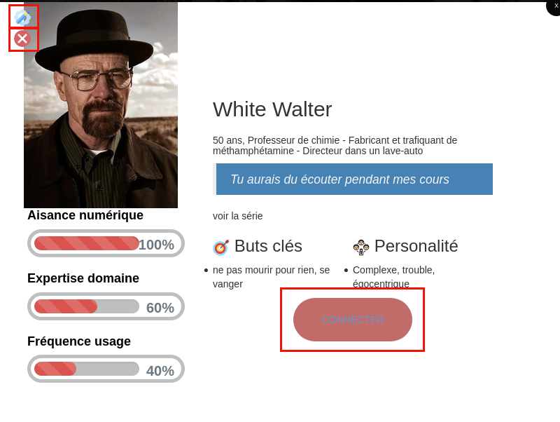
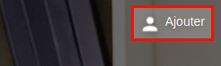
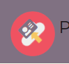

Viduc/CasBundle
=======

CasBundle est un bundle pour Symfony 5. Il permet de s'authentifié via un
serveur SSO (cas) de façon très simple. Il embarque également un système de
switch utilisateur afin de pouvoir prendre possession d'un compte utilisateur
sans connaitre ses identifiants (fonctionnalité 'EnTantQue').
Il est également aussi possible de créer des personas pour les phases de développement de votre application.

AUTEUR
------
[](https://github.com/viduc) 
[](mailto:lunde@adobe.com?subject=[GitHub]%20Source%20Han%20Sans)

STATUT
------
[](https://packagist.org/packages/viduc/casbundle)
[](LICENSE.md)
[](https://travis-ci.com/viduc/casbundle)
[](https://codecov.io/gh/viduc/casbundle/)
[](https://packagist.org/packages/viduc/casbundle)

LICENSE
-------

Copyright [2020] [Tristan FLeury]

Licensed under the Apache License, Version 2.0 (the "License");
you may not use this file except in compliance with the License.
You may obtain a copy of the License at

    http://www.apache.org/licenses/LICENSE-2.0

Unless required by applicable law or agreed to in writing, software
distributed under the License is distributed on an "AS IS" BASIS,
WITHOUT WARRANTIES OR CONDITIONS OF ANY KIND, either express or implied.
See the License for the specific language governing permissions and
limitations under the License.

<a name="prerequis"></a>
PREREQUIS
---------

Ce bundle fonctionne avec une version minimale de symfony 5.1 et une version de
php 7.2.
La dépendance jasig/phpcas est nécessaire et sera installée avec la librairie.


INSTALLATION
------------

L'installation du bundle se fait via composer:

`composer require viduc/casbundle`

CONFIGURATION
-------------
- **Configuration de la partie SSO (CAS):**
	1. créez un fichier _cas.yaml_ dans le dossier config/packages de votre application
	2. ajoutez ces deux lignes à votre fichier cas.yaml:
        ```yaml
            cas:
              host: '%env(CAS_HOST)%'
        ```
    3. éditez le fichier .env et ajouter le paramètre suivant:
        ```
            CAS_HOST=mon.serveur.cas.fr
        ```
	    ou mon.serveur.cas.fr est l'url de votre serveur sso
	4. *Class User:* par défaut le bundle est configuré pour utiliser sa class CasUser.php.
	Il est cependant conseillé de créer votre propre class utilisateur en étendant la class CasUser.php
	(ou au minimum en implémentatnt l'interface UserInterface). Si vous n'avez pas de class déjà existante,
	créez votre class dans le dosser Security par exemple (créer le dossier s'il n'existe pas) et étendez la class CasUser.php:
        ```php
        <?php
        namespace App\Security;
        
        use Viduc\CasBundle\Security\CasUser;
        
        class User extends CasUser
        {
        
        }
        ```
	
	5. *Class UserProvider*: la class UserProvider sert à charger l'objet utilisateur
	lorsque l'authentification est réussie.
	Par défaut le système utilisera la class CasUser en renseignant le login
	récupéré par le cas et en attribuant les roles *user* et *entantque*.
	Pour implémenter votre logique de chargement d'un utilisateur,
	vous devez créer une class (par ex: UserPersoProvider.php) dans le dossier Security
	(créer le dossier s'il n'existe pas) situé dans src (App).
	Cette class doit étendre la class Viduc/CasBundle/Security/UserProvider.php.
	Vous devrez ensuite surcharger la méthode:
	`chargerUtilisateurParSonLogin($username)`
	Cette méthode prend en paramètre le username (login) renvoyer par le cas
	et doit retourner un objet utilisateur (implémentant au minimum UserInterface):
        ```php
        <?php
        
        namespace App\Security;
        
        use Viduc\CasBundle\Security\UserProvider;
        use App\Security\User;
        
        class UserPersoProvider extends UserProvider
        {
            public function chargerUtilisateurParSonLogin($username)
            {
                $user = new User();
                $user->setUsername($username);
                $user->setRoles(['ROLE_USER']);
        
                return $user;
            }
        }
        ```
        C'est dans cette méthode que vous implémenterez votre propre logique de chargement utilisateur.
        Vous pouvez récupérer votre utilisateur depuis votre base de données, depuis
        un référentiel externe (ldap) ou tout autre système. Si vous souhaitez lever
        une exception (par exemple si l'utilisateur est autorisé par votre SSO mais
        n'est pas connu de l'application), utilisez de préférence les exceptions ETQ_NonAutoriseException ou
        ETQ_UtilisateurNonTrouveException (use Viduc\CasBundle\Exception\ETQ_NonAutoriseException; ou
        use Viduc\CasBundle\Exception\ETQ_UtilisateurNonTrouveException;).
        Vous devez également surcharger la méthode* 'supportsClass($class)'* pour accepter votre nouvelle class utilisateur dans le UserProvider. Ajouter donc cette méthode à ce fichier:
        ```php
            /**
         * Tells Symfony to use this provider for this User class.
         */
        public function supportsClass($class)
        {
            return User::class === $class;
        }
        ```
        Dans cette exemple nous supposons que votre class se nomme User, modifier le nom de la classe si besoin.
        
	6. *Security.yaml* : Vous pouvez maintenant modifier le fichier security.yaml
	pour prendre en compte l'authentification et le chargement de l'utilisateur.
	Ouvrez le fichier et modifier le comme ceci:

        ```yaml
            security:
                role_hierarchy:
                    ROLE_ADMIN: [ROLE_USER]
                providers:
                    viduc_provider:
                        id: Viduc\CasBundle\Security\UserProvider
                firewalls:
                    dev:
                        pattern: ^/(_(profiler|wdt)|css|images|js)/
                        security: false
                    main:
                        anonymous: true
                        logout: ~
                        guard:
                            authenticators:
                                - viduc.cas_authenticator
    
            access_control:
                - { path: ^/test, roles: ROLE_USER }
        ```

        Modifiez le provider en renseignant votre class précédemment créée:
    
        ```yaml
            providers:
                viduc_provider:
                    id: App\Security\UserPersoProvider
        ```
    7. *Test*: Si vous voulez tester rapidement le fonctionnement de l'authentification CAS,
    ajoutez au fichier routes.yaml de votre dossier config cette ligne:
        ```yaml
        _cas:
          resource: "@CasBundle/Resources/config/routes.yaml"
        ```
        Accédez ensuite à l'url de votre application suivit de "/cas" (par exemple: http://monapli/cas).
        Vous serez alors redirigé automatiquement vers votre serveur SSO pour être authentifié.
        Une fois logué, vous serez redirigé vers une page du bundle (Connexion En Tant Que)

    |                  |                                                       |
    | :--------------- |:-----------------------------------------------------|
    |   |   Si le path vous renvoi un 404 not found, essayer ces otpions: |
    |                  | **composer require symfony/apache-pack**                  |
    |                  | et dans fichier conf de votre serveur apache:         |
    |                  | **<Directory "/Library/WebServer/Documents/Your_public_symfony_directory"> .... FallbackResource /index.php .... </Directory>**|

- **Configuration de la partie En Tant Que:**

    La fonctionnalité "En Tant Que" permet de prendre le contrôle d'un compte 
    utilisateur connu de votre application. Elle est normalement réservée à un
    groupe d'utilisateur restreint (gestionnaire ou administrateur de l'application)
    et permet de tester ou vérifier des bugs ou anomalies qu'un utilisateur aurait fait remonté.
    Les utilisateurs qui auront accès à cette fonctionnalité devront avoir le rôle:
    'ROLE_ENTANTQUE'. 
    
    Pour utiliser cette fonctionnalité, il faudra tout d'abord définir un tableau
    de login d'utilisateur dont on peut prendre le contrôle.
    Vous pouvez générer ce tableau soit dans votre controller principal,
    soit dans le UserProvider ou dans un écouteur d'évènement.
    Le principe est de créer un tableau contenant des Users (CasUser ou votre propre class User)
    avec au minimum leur username (login).
    Ce tableau doit ensuite être chargé en session dans une variable nommée 'enTantQue.users'.
    Vous pouvez vous baser sur le controller CasController du bundle pour prendre exemple.
    
    Ensuite vous devrez définir un lien pour accéder à cette fonctionnalité,
    ce lien aura comme path: 'enTantQue' :
    ```html
    <a href="{{ path('enTantQue') }}">en tant que</a>
    ```
    Ce lien ouvrira la page qui permet de sélectionner un utilisateur pour prendre
    son rôle ou de revenir à l'utilisateur d'origine
    
    Lorsque l'on sélectionne un login pour se connecter, le système repassera par
    votre méthode définie dans l'UserProvider précédemment pour charger l'utilisateur demandé.
    Le compte qui sera donc chargé contiendra bien toutes les informations de la personne
    et notamment ses rôles.
	Voici un exemple d'un controller et de sa vue qui pourrait recevoir l'accès à la fonctionnalité:
	
	```php
	<?php

	namespace App\Controller;

	use Symfony\Bundle\FrameworkBundle\Controller\AbstractController;
	use Symfony\Component\Routing\Annotation\Route;
	use App\Security\User;
	use Symfony\Component\HttpFoundation\Session\SessionInterface;

	class TestController extends AbstractController
	{
		public function __construct(SessionInterface $session)
		{
			$user1 = new User();
			$user1->setUsername('test1');
			$user1->setRoles(['ROLE_USER']);
			$user2 = new User();
			$user2->setUsername('test2');
			$user2->setRoles(['ROLE_USER']);
			$users[] = $user1;
			$users[] = $user2;
			$session = $session;
			$session->set('enTantQue.users', $users);
		}

		/**
		 * @Route("/test", name="test")
		 */
		public function index()
		{
			return $this->render('test/index.html.twig', [
				'controller_name' => 'TestController',
			]);
		}
	}
    ```

	```html
	

	Hello TestController!

	

	<div class="example-wrapper">
		<h1>Se connecter en tant que...</h1>

		<a href="{{ path('enTantQue') }}">en tant que</a>
	</div>
	```
	Enfin, si vous souhaitez modifier la page (twig) de la fonctionnalité *en tant que*,
	créez un dossier CasBundle dans le dossier templates/bundles de votre application
	(créez les dossiers s'ils n'existent pas).
	Créez ensuite un fichier nommé 'enTantQue.html.twig' et mettez-y votre logique du vue.
	Faites ensuite un :
	```
    php /bin/console cache:clear
    ```
    Votre template devrait être chargé à la place du template du Bundle.
    Vous pouvez créer un lien pour le retour sur la session appelante en utilisant le path enTantQueRestore:
    ```html
    <a href="{{ path('enTantQueRestore') }}">Revenir à ma session</a>
    ```
- **Configuration des personas:**

    Cette fonctionnalité vous offre la possibilité de créer des personas (utilisés pendant le développement).
    Pour accéder à la page des personas, allez sur l'url personaIndex
    ```html
    <a href="{{ path('personaIndex') }}">Persona</a>
    ```
    ou /persona depuis le navigateur (http://monsite/persona).
    Deux personas d'exemple sont présents:
    
    
    
    En cliquant dessus vous pourrez découvrir leurs spécificités:
    
    
    
    L'icone crayon en haut à gauche vous permet de modifier le persona, la croix dessous de le supprimer.
    
    Le bouton connecter vous permet d'utiliser la fonctionnalité qui permet de se *connecter en tant que* depuis ce persona.
    
    Vous pouvez créer autant de persona que vous souhaitez.
    Pour créer un persona, cliquez sur ajouter en haut à droite de la page d'index:
    
    
    
    |                  |                                                       |
    | :--------------- |:-----------------------------------------------------|
    |   | Vous devez renseigner au moins une hierarchie de roles dans le fichier **security.yaml**: |
    |                   | role_hierarchy: ROLE_ADMIN: [ROLE_USER] |
    
    Vous pouvez ajouter une photo depuis la banque d'images à votre persona en cliquant sur la photo présente :
    
    
    
    Vous pouvez également charger vos images en cliquant sur l'icone:
    
    
    
    Reseignez les champs obligatoires pour créer votre persona.